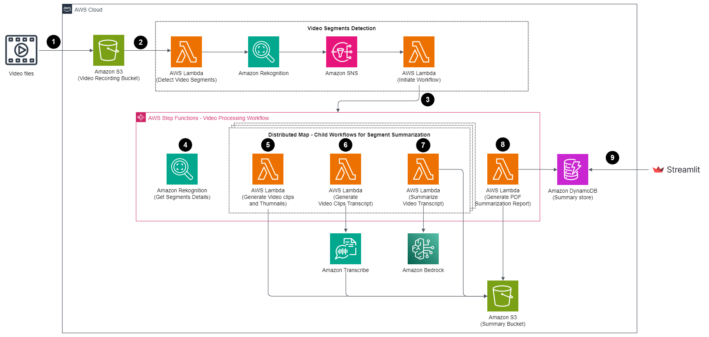

# Generate video summary report using generative AI and serverless on AWS

This repository showcases an automated method for creating comprehensive video summary reports utilizing Amazon Bedrock with the AI21 Labs Jurassic-2 Ultra model. The process involves automating the extraction of images from each frame of video presentations and generating corresponding text summaries. Additionally, it generates a consolidated PDF report that merges each frame's image with its respective text summary.

The resultant PDF report functions as a structured, visual, and textual reference for the video content. By combining images with text summaries, it ensures the meticulous preservation of crucial visual elements such as slides, charts, and diagrams. Moreover, it plays a pivotal role in extracting key points, explanations, and vital information from the video content. This enables users to swiftly review and comprehend the essential aspects of educational presentations without the necessity of watching the entire video, significantly boosting overall efficiency.

**Note:** For more hands-on labs on generative AI on AWS, please refer to this workshop: [Using generative AI on AWS for diverse content types](https://catalog.workshops.aws/genai-on-aws). In this workshop, you will use generative AI on AWS to work with various types of contents, including documents, PDFs, videos files, audios files, images, CSVs, SQL database, graph database, and application logs. 



The solutions comprises of the below steps:

1. The user initiates the process by uploading a training/webinar/presentation video file to an Amazon S3 bucket.
2. Once the video file is successfully uploaded, it triggers the Lambda function to detect segments within the video using [Amazon Rekognition Segment API](https://docs.aws.amazon.com/rekognition/latest/dg/segment-api.html)
3. After receiving successfull job completion event from Amazon Rekognition, it triggers the AWS Step Functions workflow. 
4. AWS Step Functions workflow retrieves segment details and leverages a [Ditributed Map](https://aws.amazon.com/blogs/aws/step-functions-distributed-map-a-serverless-solution-for-large-scale-parallel-data-processing/) for parallel processing. This executes child workflows in parallel, and performs Steps 5 to 7 for batches of segments.
5. Within child workflow, the Lambda function generates video clips and images for each segment using [FFMpeg](https://ffmpeg.org/) and stores them in an S3 bucket.
6. Then Lambda function generates transcripts for the video clips using Amazon Transcribe and place them in the corresponding S3 bucket.
7. Another Lambda function creates a summary of the transcripts using Amazon Bedrock with the AI21 Labs Jurassic-2 Ultra model and place the summary text file to S3 bucket.
8. In the main workflow, a Lambda function combines the generated summaries and images for each segment into a PDF document, and creates pre-signed S3 URL. Additionally, it updates an Amazon DynamoDB table with the pre-signed S3 URL.
9. Finally, a Streamlit app displays the pre-signed URL for users to download the compiled PDF document.

## Prerequisites

* [Create an AWS account](https://portal.aws.amazon.com/gp/aws/developer/registration/index.html) if you do not already have one and log in. The IAM user that you use must have sufficient permissions to make necessary AWS service calls and manage AWS resources.
* [AWS CLI](https://docs.aws.amazon.com/cli/latest/userguide/install-cliv2.html) installed and configured
* [Git Installed](https://git-scm.com/book/en/v2/Getting-Started-Installing-Git)
* [AWS Serverless Application Model](https://docs.aws.amazon.com/serverless-application-model/latest/developerguide/serverless-sam-cli-install.html) (AWS SAM) installed
* [Amazon Bedrock access setup](https://catalog.us-east-1.prod.workshops.aws/genai-on-aws/en-US/02-start-workshop/01-bedrock-setup) for Jurassic-2 Ultra model
* [Python 3.9.9](https://www.python.org/downloads/release/python-390/) installed
* Port 8501 opened for Streamlit

We recommend using [AWS Cloud9](https://aws.amazon.com/cloud9/) to create an environment to get access to the AWS CLI and SAM CLI from a bash terminal. AWS Cloud9 is a browser-based IDE that provides a development environment in the cloud. While creating the new environment, ensure you choose Linux2 as the operating system. Alternatively, you can use your bash terminal in your favorite IDE and configure your AWS credentials in your terminal.

## Deployment 

1. Clone the repo.
```shell
git clone https://github.com/aws-samples/video-summarization-serverless.git
```

2.  Run the following command to prepare our serverlress application for deploying to the AWS Cloud. This command creates a `.aws-sam` 
directory that structures your application in a format and location that next step requries.
```shell
sam build
```

3. Now, package and deploy the SAM application. This deployment will be an interactive menu, the information to give the menu is below. Run the following command.
```shell
sam deploy --guided
```
- **Stack Name**: : `video-summarization`
- **AWS Region**: `your current region (i.e. us-west-2, us-east-1)`
- **Parameter S3BucketName**: `leave as default`
- **Parameter VideoPrefix**: `leave as default`
- **Parameter VideoProcessingStagingPrefix**: `leave as default` 
- **Parameter VideoSummaryFilesPrefix**: `leave as default` 
- **Parameter VideoPDFReportFilesPrefix**: `leave as default`
- **Parameter VideoProcessingStagingPrefix**: `leave as default` 
- **Parameter VideoSummaryFilesPrefix**: `leave as default` 
- **Parameter BedrockModelId**: `leave as default` 
- **Parameter SummparyReportURLExpiration**: `leave as default` 
- **Parameter RekognitionSNSTopicName**: `leave as default` 
- **Parameter VideoProcessingWorkflowName**: `leave as default` 
- **Parameter PDFFileURLExpiration**: `leave as default` 
- **Parameter MaxConcurrency**: `leave as default`  
- **Parameter MaxItemsPerBatch**: `leave as default` 
- **Parameter WaitTimeForJob**: `leave as default` 
- **Confirm changes before deploy**: `N`
- **Allow SAM CLI IAM role creation**: `leave as default` 
- **Disable rollback**: `leave as default` 
- **Save arguments to configuration file**: `leave as default` 
- **SAM configuration file**: `leave as default`
- **SAM configuration environment**: `leave as default`

4. Verify the SAM template deployed successfully.  Also, copy the output value for the key **VideoBucket**. You will use this same S3 bucket for testing.

**Note**: For detailed steps, please refer the workshop [here](https://catalog.us-east-1.prod.workshops.aws/genai-on-aws/en-US/05-working-with-media-files/with-video-files/02-deploy): 

## Test

1. Go to the `video-summarization-serverless/test/` directory.

2. Run the following command to upload video file to the S3 bucket. Make sure to replace the `<video-bucket-name>` with the bucket name you copied earlier. 
```shell
aws s3 cp AWS-TechTalk-S3-Lifecycle.mp4 s3://<video-bucket-name>/video-files/AWS-TechTalk-S3-Lifecycle.mp4
```

3. After a few minutes, this will trigger the **video-processing-workflow** workflow. 

4. Once the workflow is completed, run the Streamlit app to view the summary. 

5. Enter the following command to install all of the Python modules and packages listed in the `requirements.txt` from within `video-summarization/ui/` directory
```shell
pip install -r requirements.txt
```

6. Launch the Streamlit app with following command.
```shell
streamlit run app.py
```

**Note**: For detailed steps, please refer the workshop [here](https://catalog.us-east-1.prod.workshops.aws/genai-on-aws/en-US/05-working-with-media-files/with-video-files/04-run-application): 

## Clean up

1. Go to the`video-summarization/` directory.

2. Run the following command to empty the video bucket. Make sure to replace the `<vide-bucket-name>` with the bucket name you copied earlier. 
```shell
aws s3 rm s3://<video-bucket-name> --recursive
```

3. Run the following command to delete the SAM template.
```shell
sam delete --stack-name video-summarization --no-prompts 
```

## Security

See [CONTRIBUTING](CONTRIBUTING.md#security-issue-notifications) for more information.

## License

This library is licensed under the MIT-0 License. See the LICENSE file.

## DISCLAIMER

The solution architecture sample code is provided without any guarantees, and you're not recommended to use it for production-grade workloads. The intention is to provide content to build and learn. Be sure of reading the licensing terms.
